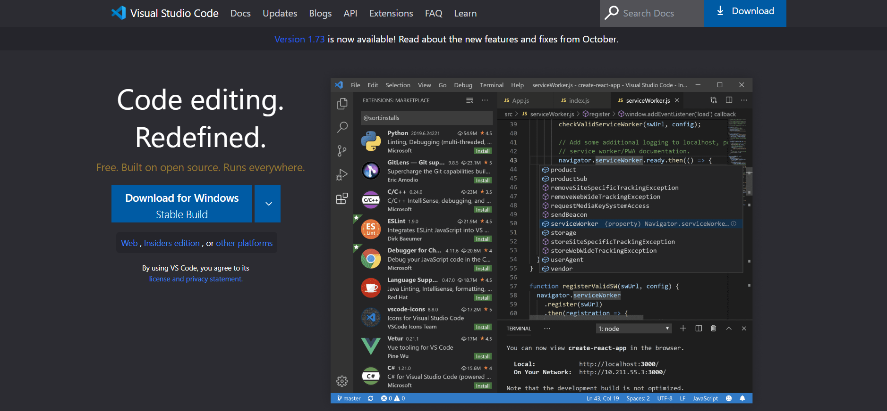

## Assignment summary of Bootcamp FSJS 2.0  

### Projects

**Project:** 01-Project 
**Project descriptions:** Html and css . 
**CodeBase:** [01-Project](https://github.com/manishdashsharma/01-Project-HTML-CSS) 
**Deployed link:** [01-Project-link](https://manishdashsharma.github.io/01-Project-HTML-CSS/) 
**Output:**&nbsp;

**Project:** 02-Project 
**Project descriptions:** Html and css . 
**CodeBase:** [02-Project](https://github.com/manishdashsharma/02-Project-HTML-CSS) 
**Deployed link:** [02-Project-link](https://manishdashsharma.github.io/02-Project-HTML-CSS/) 
**Output:**&nbsp;
 
**Project:** 03-Project 
**Project descriptions:** Html and css . 
**CodeBase:** [03-Project](https://github.com/manishdashsharma/03-Project-HTML-CSS) 
**Deployed link:** [03-Project-link](https://manishdashsharma.github.io/03-Project-HTML-CSS/) 
**Output:**&nbsp;

**Project:** 04-Project 
**Project descriptions:** Html and css . 
**CodeBase:** [04-Project](https://github.com/manishdashsharma/04-Project-HTML-CSS) 
**Deployed link:** [04-Project-link](https://manishdashsharma.github.io/04-Project-HTML-CSS/) 
**Output:**&nbsp;

**Project:** 05-Project 
**Project descriptions:** Html and css . 
**CodeBase:** [05-Project](https://github.com/manishdashsharma/05-Project-HTML-CSS) 
**Deployed link:** [05-Project-link](https://manishdashsharma.github.io/05-Project-HTML-CSS/) 
**Output:**&nbsp;

**Project:** 06-Project 
**Project descriptions:** Html and css . 
**CodeBase:** [06-Project](https://github.com/manishdashsharma/06-Project-HTML-CSS) 
**Deployed link:** [06-Project-link](https://manishdashsharma.github.io/06-Project-HTML-CSS/) 
**Output:**&nbsp;

**Project:** 07-Project 
**Project descriptions:** Html and Tailwind-CSS . 
**CodeBase:** [07-Project-tailwind](https://github.com/manishdashsharma/06-Project-HTML-CSS) 
**Deployed link:** [07-Project-link-tailwind](https://manishdashsharma.github.io/06-Project-HTML-CSS/) 
**Output:**&nbsp;

### Blogs

**Blog:** Guide to Media-Query 
**Blog descriptions:** Blog is all about a `Guide to Media-Query` 
**Blog link:** [Guide to Media-Query](https://manishashsharma.hashnode.dev/guide-to-media-query)&nbsp;

**Blog:** Guide to flex box 
**Blog descriptions:** Blog is all about a `Guide to flex-box` 
**Blog link:** [Guide to flex box](https://manishashsharma.hashnode.dev/guide-to-flex-box)&nbsp;

**Blog:** Guide to CSS Positioning 
**Blog descriptions:** Blog is all about a `Guide to CSS Positioning` 
**Blog link:** [Guide to CSS Positioning](https://manishashsharma.hashnode.dev/guide-to-css-positioning)&nbsp;

**Blog:** CSS-Selectors ? 
**Blog descriptions:** Blog is all about a `CSS-Selectors ?` 
**Blog link:** [CSS-Selectors](https://manishashsharma.hashnode.dev/css-selectors)&nbsp;